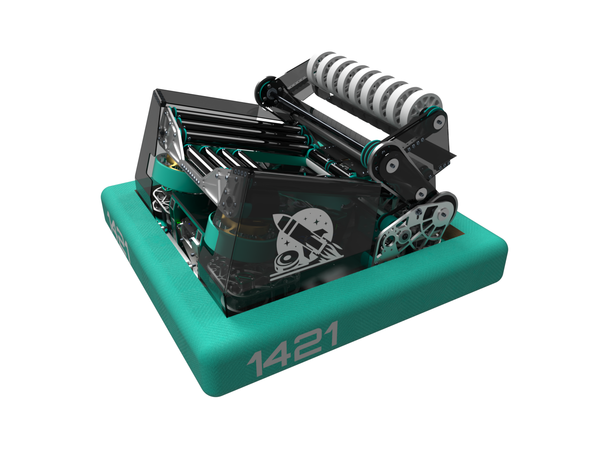

# Background

CADmas was the first frcdesign.org CADathon, being an internal CADathon for the DDS discord server. In this cadathon, the F4 CADathon 8 game, Powerplay, was played, where the robots shot 2.75 inch acetal hockey pucks.

# Winner
## 1421 Liftoff
Names:

Brendan

Vaughn - FRC team 8033

Neel - FRC team 5026

### Robot: Epsilon

[Main Assembly](https://cad.onshape.com/documents/37d79a03e3cfb05f227cbbae/w/b8841221f28e55750c136efa/e/7de11281be5a26644f428e99
)

[Shooter](https://cad.onshape.com/documents/dfb835505a9955ded488cead/w/38cf9707db3db6e395ed9733/e/1628c1a5307ef9d715f30524)

[Intake](https://cad.onshape.com/documents/1af62636e590478551fefd15/w/30a901a893c04b5f425cc0cb/e/23df801737c34751d1ad1c9b )

[Drivebase/Serializer](https://cad.onshape.com/documents/9e136789b08dcd71a4349792/w/57c6a3238a43ec4734950183/e/7caaf1c27cce60f0c397f887)

[Technical Documents](https://docs.google.com/document/d/1NWPqIlKru55cYiTqR7oexpBmehZZDWZMny1_LcYR1uQ/edit)

## 2nd Place

## 3rd Place