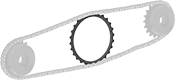
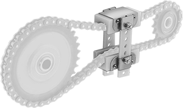
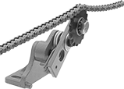
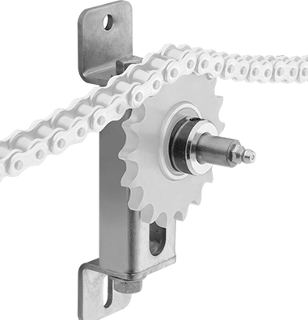
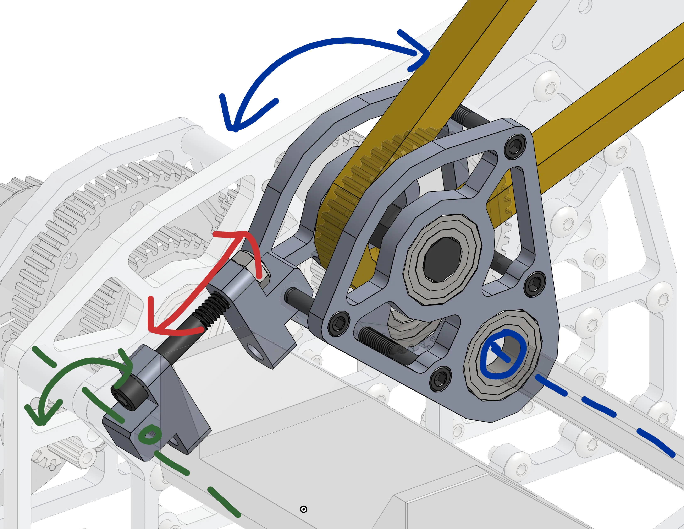
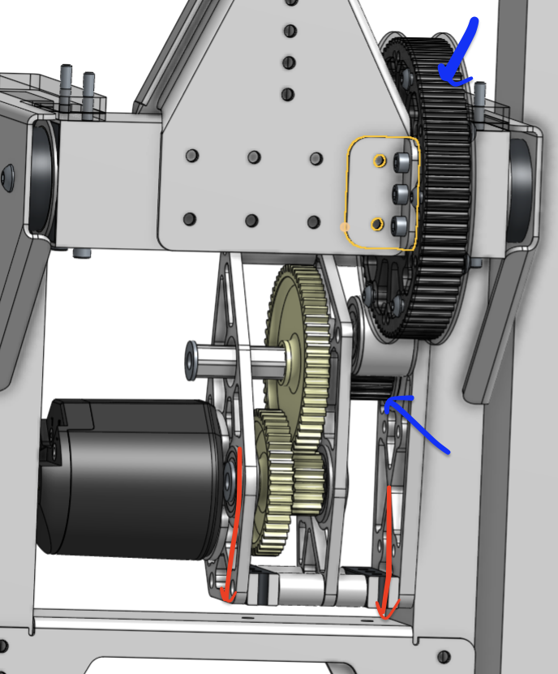

---
title: Tensioning
description: Tensioning in pivot mechanisms
---

## Tensioning

To accommodate chain stretch over the course of a season and reduce backlash, an active tensioning system is required. 

# Inline Tensioners

The simplest and easiest way to tension a chain is to use an inline tensioner. These come in two flavors, Spartan Tensioners and Inline Tensioners (see image below). These pull on the ends of the chain loop increasing or decreasing the loop length in very small increments. However, these aren't designed to contact sprocket teeth, so are only useful if there is enough chain length available

<ContentFigure src="../img/2b/chaintensioncut.webp" gif width="60%" alt="Chain and sprocket with turnbuckle tensioner">A chain and sprocket moving with a turnbuckle tensioner. The turnbuckle is located on the bottom half the chain.</ContentFigure>

<Slides>
  
  Turnbuckle tensioner

  
  Spartan tensioner
</Slides>

# Floaters

Floating chain tensioners are nice to work with because they do not require any additional structure and mount directly to the chain. These come in two types. One type squeezes the outsides of the chain pulling it inward in order to tension it, while the other is a sprocket that sits on the inside of the chain pushing the sides outward in order to tension it.

Floating sprockets come in discrete sizes, so there is less fine adjustability in the tension of the chain. These are generally used when space is a constraint, since they do not need lubrication or tools to adjust, and are very compact to install. They may also vibrate at high speeds and can come out if there is a bit of slack on the chain.

Floating chain tensioners squeeze the chain from both sides. This can add friction which reduces the efficiency of the system at the tradeoff of less complexity relative to an adjustible gearbox or idler gear. Additionally, the width of the tensioner has to be smaller than the diameter of the smaller sprocket or else it will slide towards the smaller sprocket and get stuck. COTS vendors sell premade inline tensioners, or teams can make their own. 
These tensioners are only held onto the chain from the tension of the chain applying pressure on the tensioner, so this has a centering effect on the tensioner because that is where forces are roughly equal. In effect, these tensioners aren't rigidly attached. Hard impacts and gravity can cause disturbances in these tensioners, but teams have used them reliably in the past.

<Slides>
  
  Floating Ring Tensioner
  
  Floating Outside Tensioner
  
  1323's Custom Floating Zip Tie Clamping Tensioner
</Slides>

# Idlers

Idlers are dead sprockets that can spin freely, positioned in such a way that they tug on the chain providing tension. They can be spring loaded to automatically tension them or screw driven. They can move linearly or rotationally. Teams can also purchase cots chain tensioners from COTS vendors, or make their own. 

<Slides>
  
  Spring Loaded Rotational Tensioner
  
  Screw Adjustible Linear Tensioner
</Slides>

# Moving Sprockets

This is probably the most common form of chain tensioning in FRC. Mounting points for the sprockets can be moved rotationally or linearly through screws and springs to pull them away from each other in order to tension the chain.

<Slides>

<LinkButton href="https://frcdesign.org/mechanism-examples/pivots/2910_2023_pivot/">2910 Rotational Chain Tensioner</LinkButton>

This belt tensioner from 1114 Simbotics shows a sliding gearbox with bolts to the bottom (shown in red) to adjust the center to center distance of the pulleys in order to tension the belt that powers their end effector. A similar idea can be used with chains
</Slides>

### Reference Design

For this design, enough chain length was provided for a simple inline spartan tensioner to work well.
